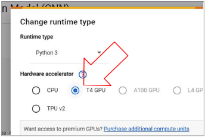
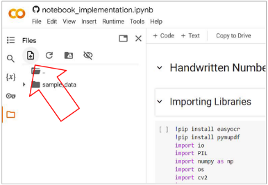
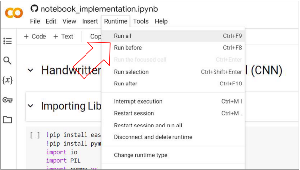
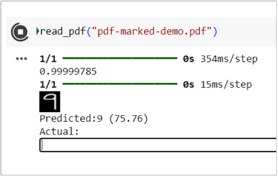
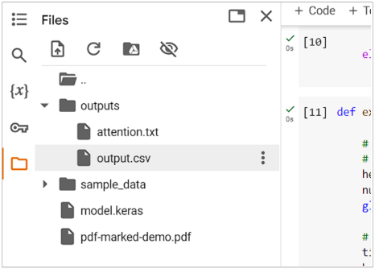
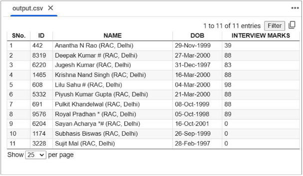
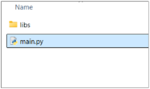
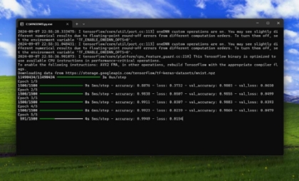
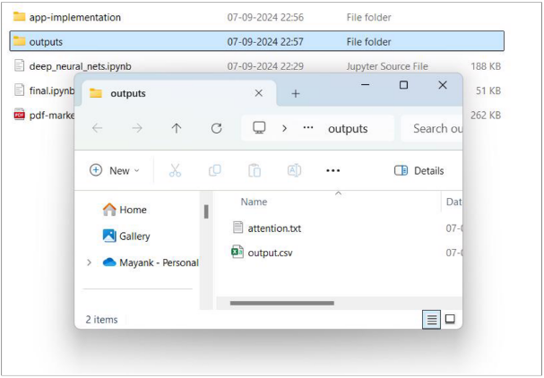

<H1>How to Run it (Click to navigate)</H1>

1. [**On Google Colab** ](#_page0_x69.00_y180.92) 
1. [**On Local Machine** ](#_page3_x69.00_y390.92)

 <h2>Google Colab</h2> 

1. **Open the Colab link**

   Click on the provided Colab link to open the notebook in your browser. 

2. **Change Runtime Type** 
- Go to the top menu bar. 
- Click on Runtime -> Change runtime type. 
- Set the **hardware accelerator** to T4 GPU. 
- Then, click on **Save**. 

3. **Upload PDF File** 
- In the code cell for file upload, click the “Run” button. 
- A file uploader will appear below the cell. 
- Select the PDF file you want to convert. 

4. **Run the Code** 
- Click on Runtime -> Run all from the top ribbon. 

5. **Provide Feedback** 

   If prompted by the notebook, follow any instructions for providing feedback. This step is useful for improving the model. 

6. **Check the Output** 
- Once the process is complete, the CSV file generated from the PDF will be available in  **/outputs**  
- attention.txt contains list of cells requiring attention  
- output.csv is the generated file which may be opened with a spreadsheet software like **MS Excel** 

Download from runtime storage and make any required polish. 

<h2> On Local Machine </h2>
1. **!! Ensure python 3.10+  is installed.** 
1. Navigate to **./app-implementation** 

3. Run **./app-implementation/main.py** 

4. Check **./output** 

